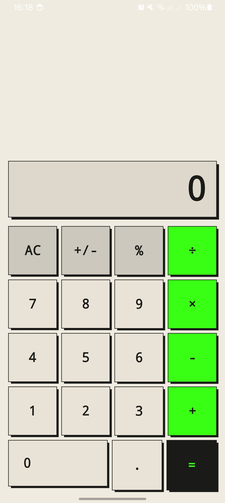

#  Calculadora Kotlin Android

Aplicativo de calculadora desenvolvido com **Kotlin** e **Jetpack Compose** como atividade prática da disciplina de Programação para Dispositivos Móveis II (PDMII) na **Fatec Registro**.

O projeto aplica na prática os conceitos de composição de interface, gerenciamento de estado reativo e separação entre UI e regra de negócio.

---

##  Funcionalidades

- Quatro operações matemáticas: adição, subtração, multiplicação e divisão
- Visor reativo com atualização em tempo real a cada clique
- Operações encadeadas sem necessidade de pressionar `=` entre elas
- Inversão de sinal (`+/-`) e cálculo de porcentagem (`%`)
- Indicador visual do operador ativo
- Tratamento de erros: divisão por zero exibe `ERR` no visor
- Limite de 11 dígitos no visor

---

##  Tecnologias

| Tecnologia | Versão |
|---|---|
| Kotlin | 2.x |
| Jetpack Compose | BOM mais recente |
| Material 3 | — |
| Android Studio | Ladybug+ |
| Gradle (KTS) | — |
| Min SDK | API 24 (Android 7.0) |

---

## Estrutura do Projeto

```
app/src/main/java/com/example/calculadora_kotlin_android/
├── MainActivity.kt
├── screens/
│   └── CalculadoraScreen.kt   # UI + lógica da calculadora
└── ui/theme/
    ├── Color.kt
    ├── Theme.kt
    └── Type.kt
```

### Classe `Calculadora`

A regra de negócio segue o diagrama UML definido na atividade:

```
┌─────────────────────────┐
│       Calculadora       │
├─────────────────────────┤
│ + num01: Double         │
│ + num02: Double         │
├─────────────────────────┤
│ + somar()               │
│ + subtrair()            │
│ + multiplicar()         │
│ + dividir()             │
└─────────────────────────┘
```

---

##  Screenshots



---
## 🚀 Como rodar localmente

### Pré-requisitos

- [Android Studio](https://developer.android.com/studio) instalado
- SDK Android API 24 ou superior configurado
- Dispositivo físico ou emulador Android

### Passos

```bash
# 1. Clone o repositório
git clone https://github.com/IgorLGomes/calculadora-kotlin-android.git

# 2. Abra o projeto no Android Studio
# File → Open → selecione a pasta clonada

# 3. Aguarde o Gradle sincronizar

# 4. Rode o app
# Clique em Run ▶ ou use Shift + F10
```

---

## 📚 Contexto Acadêmico

| Campo | Detalhe |
|---|---|
| Disciplina | Programação para Dispositivos Móveis II (PDMII) |
| Atividade | ATV1 — Prática |
| Instituição | Fatec Registro |

---

## 📄 Licença

Projeto acadêmico — sem licença de distribuição definida.